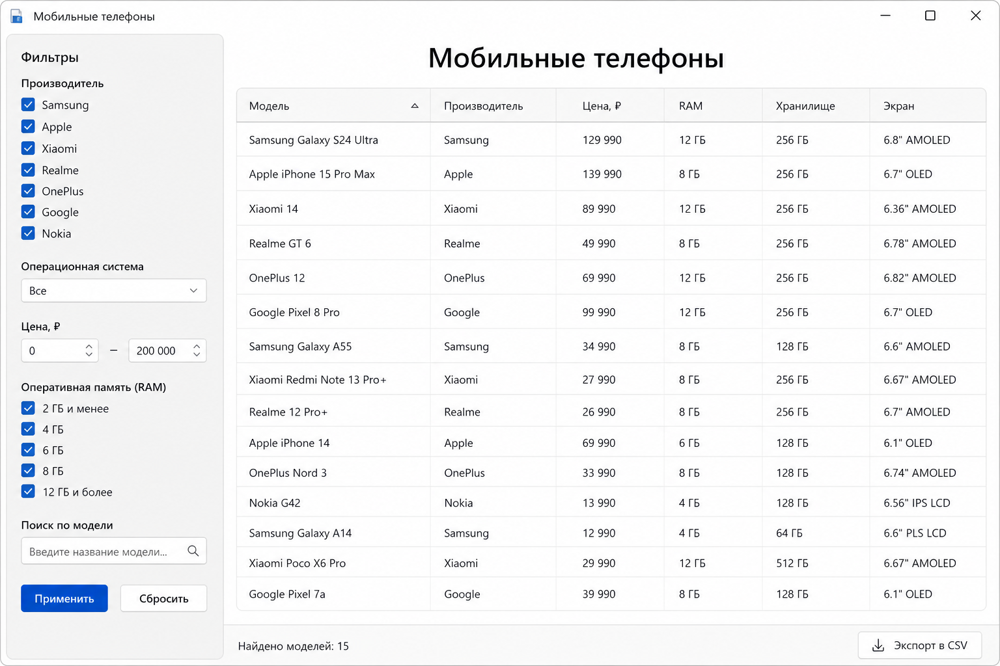
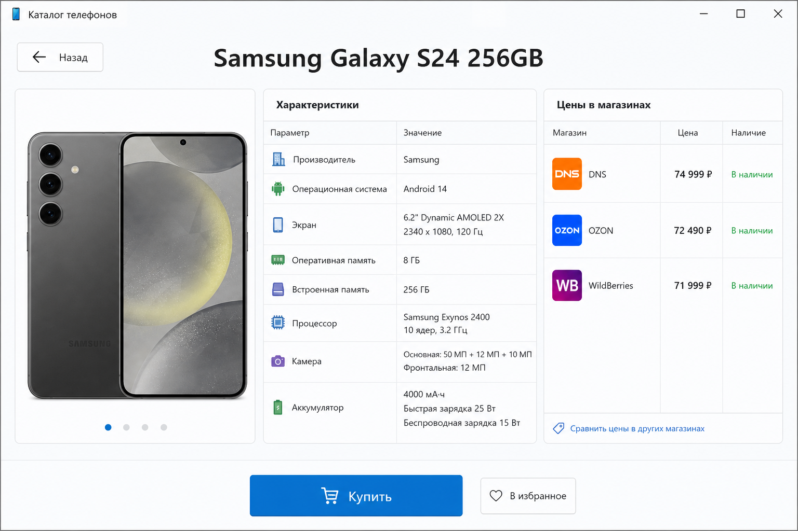
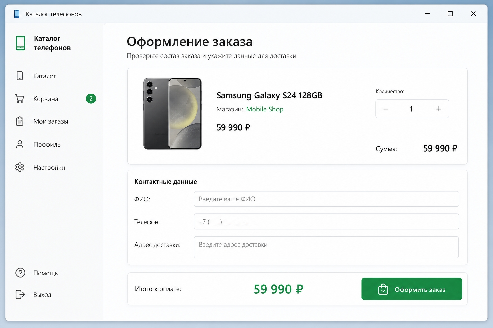

# WinFormsCatalog

Каталог мобильных телефонов на .NET 9 WinForms и PostgreSQL.

## Скриншоты







## Возможности

- Каталог с фильтрами и сортировкой (запросы в PostgreSQL)
- Карточка товара с ценами в магазинах
- Оформление заказа с сохранением в БД

## Стек

- .NET 9, Windows Forms
- PostgreSQL 16
- Entity Framework Core 9, Npgsql
- xUnit

## Структура

```
WinFormsCatalog/          — UI
WinFormsCatalog.Core/     — EF Core, сервисы, миграции
WinFormsCatalog.Tests/    — тесты
database/                 — SQL-скрипт установки
scripts/                  — скрипты миграций и проверки
```

## Запуск

### 1. База данных

**Docker:**

```bash
docker compose up -d
```

**Локальный PostgreSQL:** создайте базу `catalog`, затем выполните `database/install-catalog.sql` в DBeaver (Execute SQL Script).

### 2. Миграции (альтернатива SQL-скрипту)

```powershell
.\scripts\init-db.ps1
```

### 3. Настройка подключения

Скопируйте пример и укажите свой пароль:

```powershell
copy WinFormsCatalog\appsettings.example.json WinFormsCatalog\appsettings.Development.json
```

### 4. Запуск приложения

```bash
dotnet run --project WinFormsCatalog
```

## Тесты

```powershell
.\scripts\init-db.ps1
dotnet test
```

## CI

GitHub Actions: сборка, миграции, интеграционные тесты (`.github/workflows/ci.yml`).

## Требования

- Windows
- .NET 9 SDK
- PostgreSQL 16 или Docker
